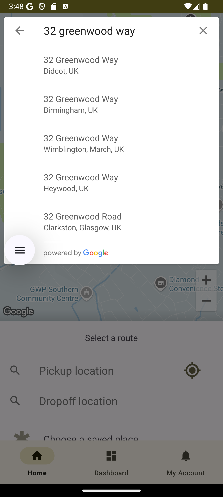
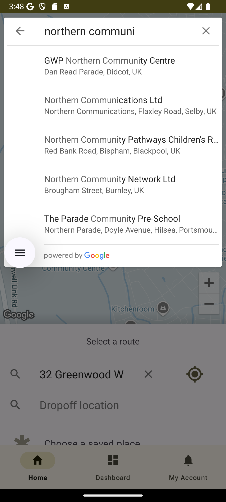
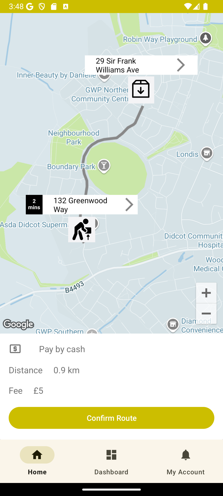
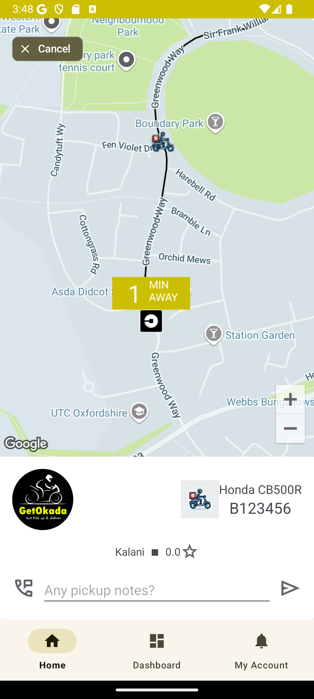
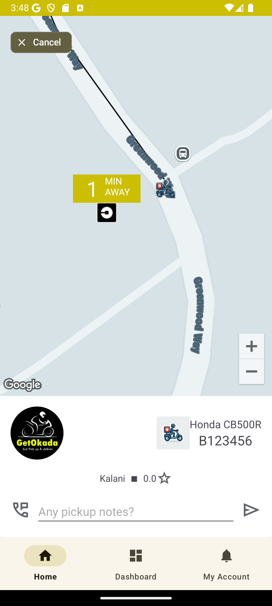
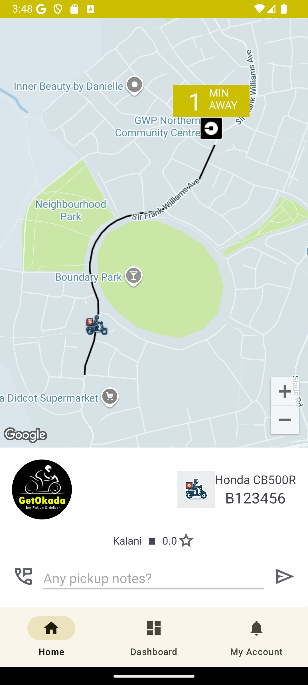
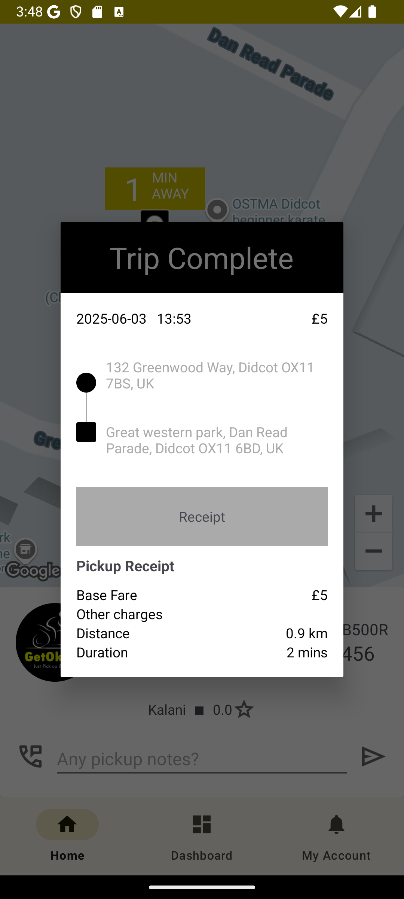

# Delivery Client 🚴📦

A mobile client app for managing delivery requests, showing nearby bikers, and tracking the delivery process from pickup to completion.

## 📸 Screenshots

| From Address | To Address | Confirm Pickup |
|--------------|------------|----------------|
|  |  |  |

| Pickup on the Way | Driver Arrived | On Route to Destination | Complete |
|-------------------|----------------|--------------------------|----------|
|  |  |  |  |

## Features
- Live tracking of all bikers near the user’s position
- Address picker for delivery origin & destination  
- Real-time status updates: pickup, en route, arrived, completed  
- Smooth UI with visual progress steps

  <video width="250" height="275" src="https://github.com/user-attachments/assets/f5ea30d5-b5ae-444a-b092-99b653bb7177" frameborder="0" allowfullscreen></video>

## Tech Stack
- Android and Kotlin
- Google Maps API
- Firebase
